# Shouts & Whispers — UI requirements

The executable specification of the app's user interface. Every leaf
requirement (a numbered line with no finer-numbered child) is claimed by
**exactly one** case of exactly one kind under `dev/requirements/<kind>/cases/`
— the coverage gate (`test/coverage_gate_test.dart`) fails the build on any
leaf without a case, case without a leaf, or double claim. The framework
conventions are in [README.md](README.md); the UI's dependency-injection
architecture that makes these tests possible is
[docs/UI-ARCHITECTURE.md](../../docs/UI-ARCHITECTURE.md).

> **What green means here.** These cases drive the real app shell against
> scripted fakes (location, server, auth, clock, map tiles) and verify what
> the UI renders and requests. They deliberately do **not** verify the
> platform boundaries themselves: real GPS permission dialogs, real Google
> sign-in, real Firestore/Functions traffic, push delivery, or store
> installability. Those live at the adapter/backend layers
> (`functions/test/`, security-rules checks) and in the deliberate v1 gaps
> listed in [docs/DESIGN.md](../../docs/DESIGN.md) §7. A green suite means:
> *given* honest adapters, the UI shows and does what this document says.

**Kinds:** `screen` — a rendered resting state, pixel-compared against a
committed golden PNG (shown inline below each leaf). `saga` — a multi-step
user story rendered as an ordered storyboard of golden frames. `behavior` —
a driven gesture asserted by code (what a static image cannot observe).
`logic` — a pure product rule verified against shipped code. Images are
regenerated, never hand-edited; committed goldens are owner-approved
expecteds.

**Fixture world.** The clock is pinned to `2026-06-01 12:00` local
(`referenceNow`); sample positions sit around Rothschild Blvd, Tel Aviv
(32.0731, 34.7799); map tiles are the deterministic fake checkerboard; the
sample cast is "You Yourself" (the signed-in user), "Ada Lovelace", and
"Grace Hopper", avatars deliberately photo-less.

---

## 1. Sign-in screen

The first thing a signed-out user sees.

- `1.1` The screen shows the megaphone mark, and the app name **"Shouts &
  Whispers"** as the headline.

   <!-- req-gallery:1.1 -->
- `1.2` The one-line pitch reads exactly: **"Message the people around you
  right now — a whisper reaches 150 m, a shout the whole neighborhood."**

  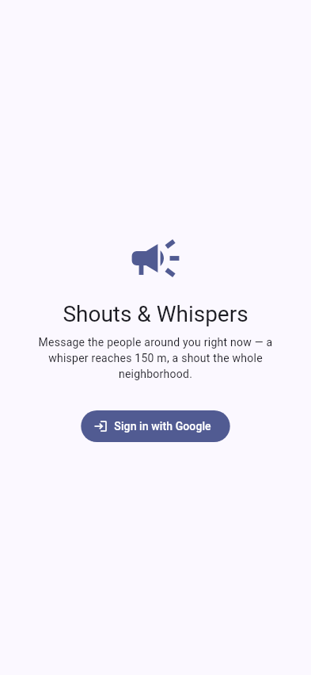 <!-- req-gallery:1.2 -->
- `1.3` A filled **"Sign in with Google"** button with the login icon is the
  single call to action.

   <!-- req-gallery:1.3 -->
- `1.4` While sign-in is in flight, the button is replaced by a progress
  spinner.

  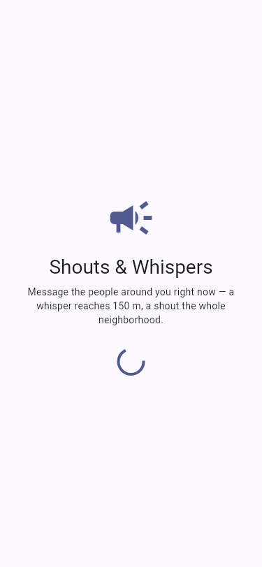 <!-- req-gallery:1.4 -->
- `1.5` A failed sign-in shows the failure message beneath, in the theme's
  error color.

  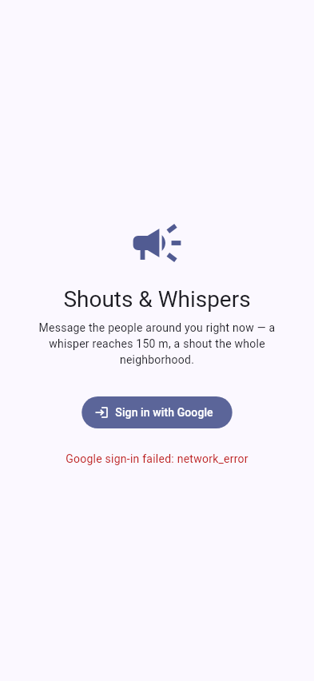 <!-- req-gallery:1.5 -->
- `1.6` A sign-in the user backs out of (canceled) shows **no** error.
- `1.7` Tapping the button starts the Google sign-in flow exactly once.

## 2. Setup-required screen

Shown instead of the app when Firebase isn't configured yet (fresh checkout).

- `2.1` The screen shows a **"Setup required"** headline with the build icon
  and the selectable setup instructions text.

  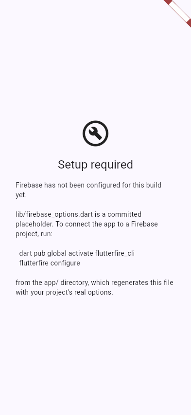 <!-- req-gallery:2.1 -->

## 3. Auth gate

- `3.1` A signed-out user is shown the sign-in screen.
- `3.2` A signed-in user is shown the home screen.
- `3.3` Signing out from the home screen returns to the sign-in screen.
- `3.4` A different signed-in account gets a freshly mounted home screen
  (screen state is keyed by the user id).

## 4. Map

The top of the home screen; where messages live in space.

- `4.1` Before the first GPS fix, the map shows the world view (zoom far
  out) with no self marker.

  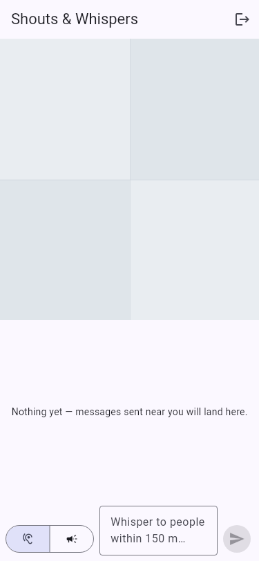 <!-- req-gallery:4.1 -->
- `4.2` After a fix, the self marker — a white-ringed blue dot — sits at the
  device position.

   <!-- req-gallery:4.2 -->
- `4.3` The first fix recenters the map onto the device position at
  neighborhood zoom (15).
- `4.4` A received **shout** is marked at its send location with the
  megaphone icon in deep orange.

  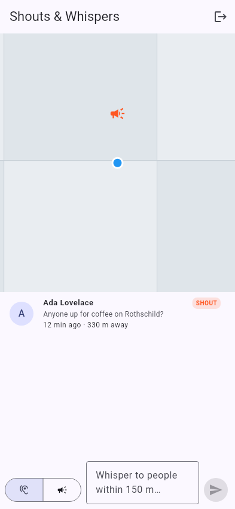 <!-- req-gallery:4.4 -->
- `4.5` A received **whisper** is marked at its send location with the ear
  icon in indigo.

  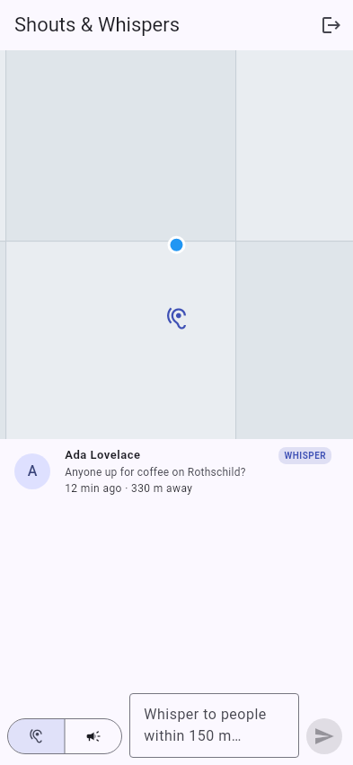 <!-- req-gallery:4.5 -->
- `4.6` Every feed entry — including your own messages — has its marker on
  the map.

  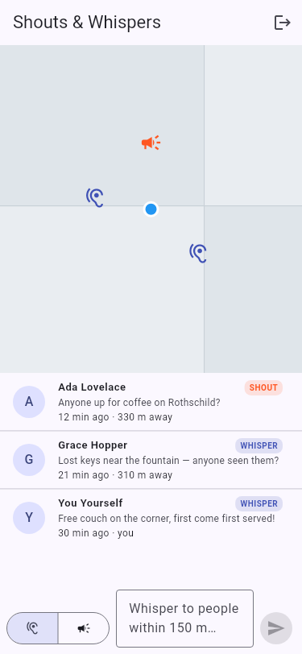 <!-- req-gallery:4.6 -->

## 5. Location problems

A dismissable-by-fixing banner between map and feed; the app is honest when
it cannot know where it is.

- `5.1` When location services are off, the banner reads exactly:
  **"Location services are turned off. Turn them on to send and receive
  nearby messages."**

  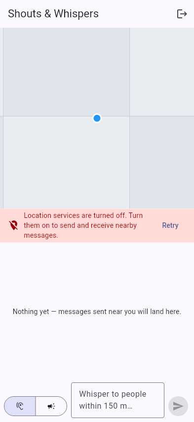 <!-- req-gallery:5.1 -->
- `5.2` When permission is denied, the banner reads exactly: **"Location
  permission denied — nearby messaging needs your position."**

  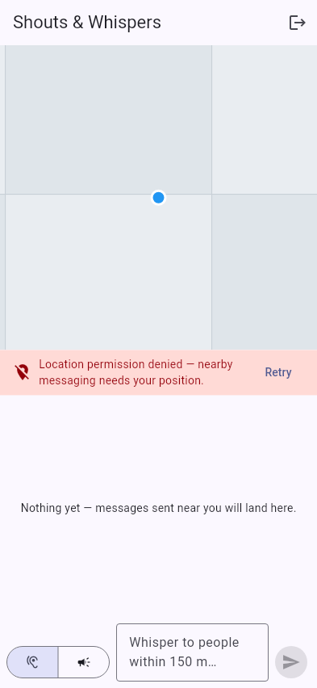 <!-- req-gallery:5.2 -->
- `5.3` When permission is permanently denied, the banner reads exactly:
  **"Location permission is permanently denied. Enable it for this app in
  your system settings, then retry."**

  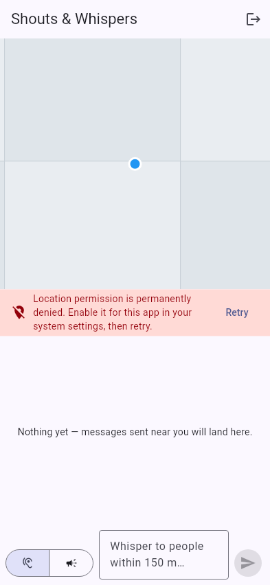 <!-- req-gallery:5.3 -->
- `5.4` When there is no location problem, no banner is shown.
- `5.5` The banner's **Retry** re-runs the location start-up (permission
  check and stream).

## 6. Feed

The durable inbox: everything that reached you, newest first.

- `6.1` Before the first feed snapshot arrives, the feed area shows a
  progress spinner.

  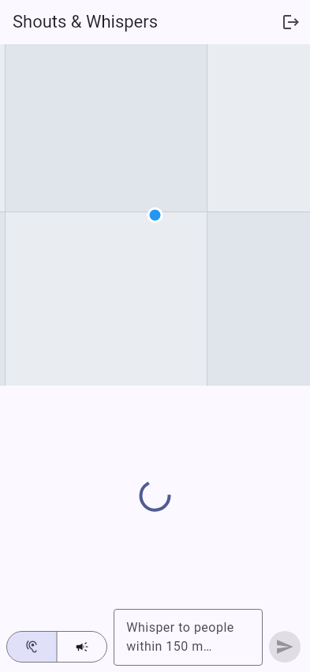 <!-- req-gallery:6.1 -->
- `6.2` An empty feed reads exactly: **"Nothing yet — messages sent near you
  will land here."**

   <!-- req-gallery:6.2 -->
- `6.3` A feed entry shows the sender's name (emphasized) and the message
  text.

  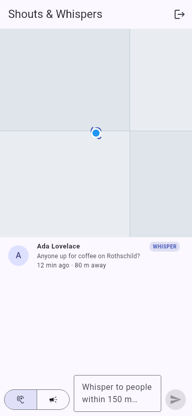 <!-- req-gallery:6.3 -->
- `6.4` A whisper entry carries the indigo **WHISPER** badge.

   <!-- req-gallery:6.4 -->
- `6.5` A shout entry carries the deep-orange **SHOUT** badge.

  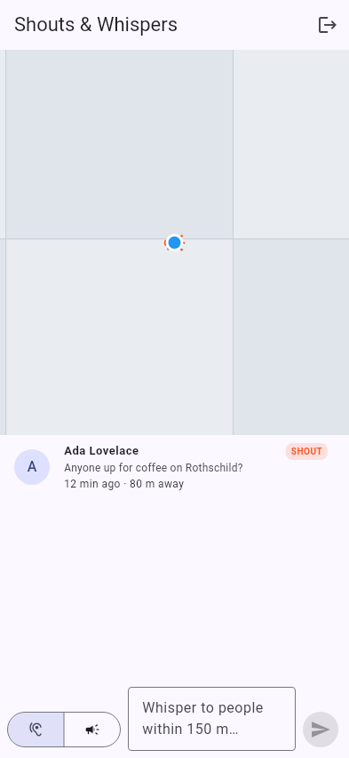 <!-- req-gallery:6.5 -->
- `6.6` An entry's meta line is "<relative time> · <distance>", e.g.
  **"12 min ago · 320 m away"**.

   <!-- req-gallery:6.6 -->
- `6.7` Your own message's meta line shows **"you"** instead of a distance.

  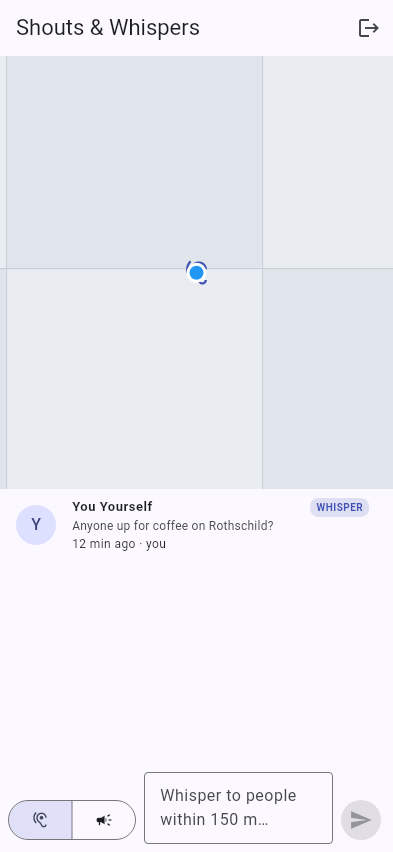 <!-- req-gallery:6.7 -->
- `6.8` A sender without a photo gets an avatar with the first letter of
  their name.

   <!-- req-gallery:6.8 -->
- `6.9` Entries are ordered newest first.
- `6.10` A broken feed stream shows **"Feed unavailable: …"** with the
  error.

  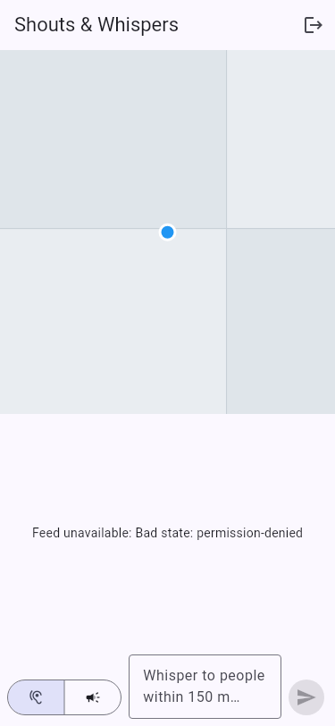 <!-- req-gallery:6.10 -->

## 7. Composer

One row at the bottom: pick a range, type, send.

- `7.1` The range toggle offers exactly two segments: whisper (ear icon) and
  shout (megaphone icon).

   <!-- req-gallery:7.1 -->
- `7.2` Whisper is preselected — the quiet option is the default.
- `7.3` With whisper selected, the input hint reads exactly: **"Whisper to
  people within 150 m…"**

   <!-- req-gallery:7.3 -->
- `7.4` With shout selected, the input hint reads exactly: **"Shout to
  people within 1500 m…"**

  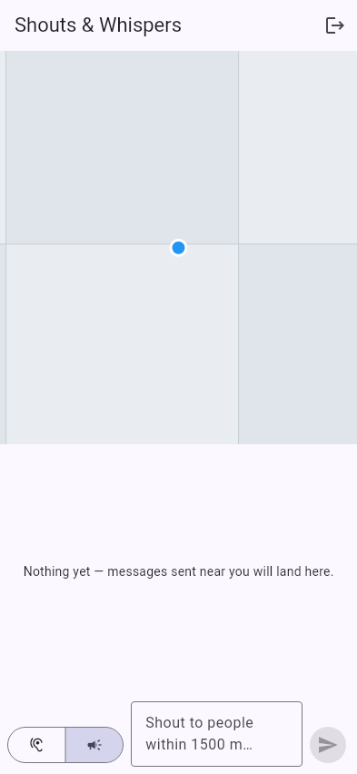 <!-- req-gallery:7.4 -->
- `7.5` Without a GPS fix the send button is disabled, with the tooltip
  **"Waiting for a GPS fix…"**.
- `7.6` With empty or whitespace-only text the send button is disabled.
- `7.7` With a fix and non-blank text the send button is enabled.
- `7.8` While a send is in flight, the send button shows a progress spinner.

  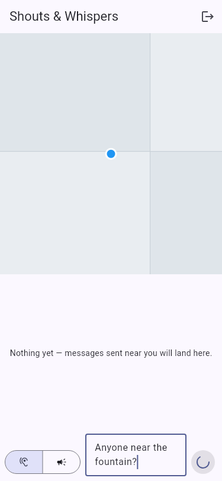 <!-- req-gallery:7.8 -->
- `7.9` The input accepts at most 500 characters.

## 8. Sending

- `8.1` Sending passes the trimmed text, the selected kind, and the current
  device position to the backend.
- `8.2` After a successful send a snackbar reads **"Delivered to N people
  nearby"** with the recipient count.

  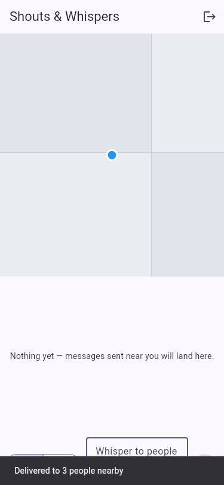 <!-- req-gallery:8.2 -->
- `8.3` A successful send clears the input field.
- `8.4` A failed send shows **"Send failed: …"** and keeps the typed text
  for retry.
- `8.5` Submitting from the keyboard (send action) sends, same as the
  button.

## 9. Deleting an entry

Your feed, your copy.

- `9.1` Long-pressing an entry opens a confirmation dialog titled **"Delete
  from your feed?"** with the body **"This removes your copy only — other
  recipients keep theirs."** and Cancel / Delete actions.

  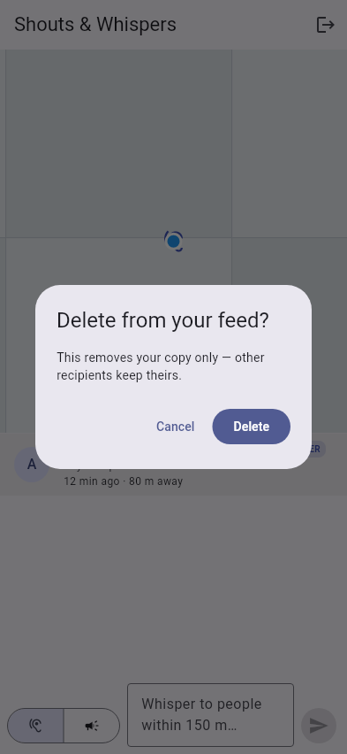 <!-- req-gallery:9.1 -->
- `9.2` Cancel leaves the entry in place and deletes nothing.
- `9.3` Delete requests deletion of exactly that entry from the backend.

## 10. Formatting and wire rules

The pure rules the widgets above lean on.

- `10.1` A message younger than a minute is dated **"just now"**.
- `10.2` Under an hour, age is shown as **"N min ago"**.
- `10.3` Under a day, age is shown as **"N h ago"**.
- `10.4` A day or older, the meta shows the calendar date and time (e.g.
  **"May 28, 3:40 PM"**).
- `10.5` Distances under a kilometre read **"N m away"**, metre-rounded.
- `10.6` A kilometre and beyond reads **"X.Y km away"**, one decimal.
- `10.7` Your own messages read **"you"** in place of any distance.
- `10.8` The wire values for message kinds are exactly `'whisper'` and
  `'shout'`; an unknown wire value falls back to shout rather than crashing
  the feed.
- `10.9` The client's product constants match the spec: whisper radius 150 m,
  shout radius 1,500 m, max message length 500.

## 11. User sagas

Complete use cases as storyboards — each frame is a golden of the real UI at
that step of the story.

- `11.1` **First launch.** A new user signs in with Google, lands on the
  home screen while the app waits for a GPS fix (send disabled), the fix
  arrives (map recenters, blue dot appears, send still needs text), and the
  feed greets them empty.

   <!-- req-gallery:11.1:1 -->
  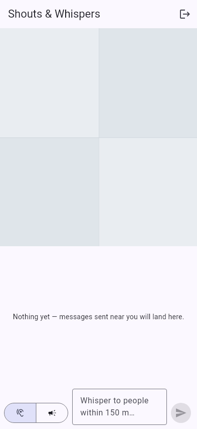 <!-- req-gallery:11.1:2 -->
  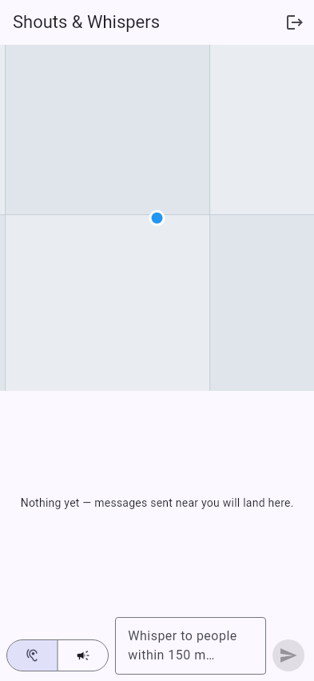 <!-- req-gallery:11.1:3 -->
  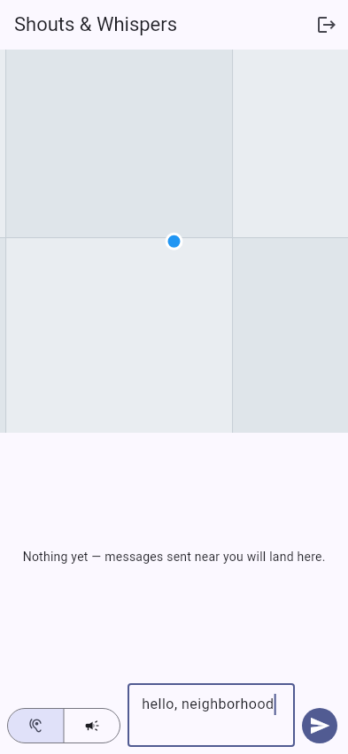 <!-- req-gallery:11.1:4 -->
- `11.2` **A shout arrives.** While you stand on Rothschild Blvd, Ada —
  400 m away — shouts; the message lands in your feed with the SHOUT badge
  and its megaphone marker appears on the map where she stood.

   <!-- req-gallery:11.2:1 -->
   <!-- req-gallery:11.2:2 -->
  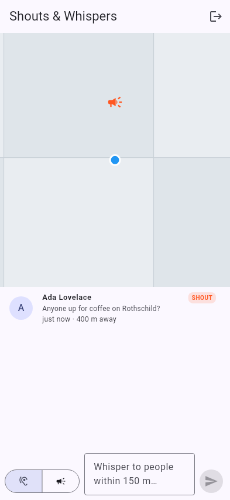 <!-- req-gallery:11.2:3 -->
- `11.3` **Whispering back.** You type a reply, flip the toggle stays
  whisper, send it — the button spins while in flight — and the snackbar
  confirms **"Delivered to 1 people nearby"** while your own entry tops the
  feed marked **"you"**.

  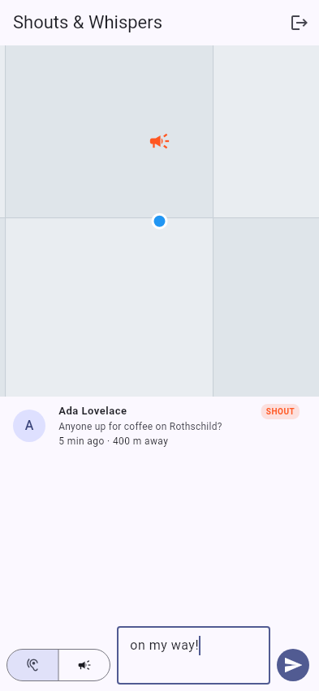 <!-- req-gallery:11.3:1 -->
  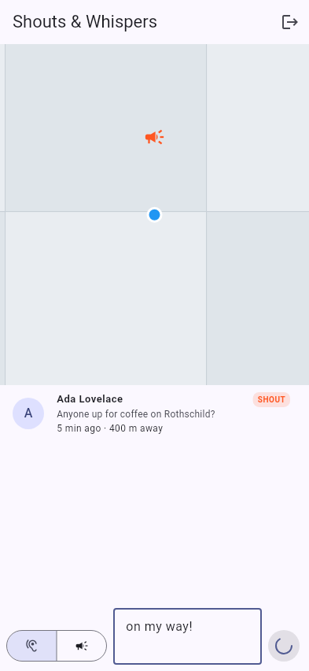 <!-- req-gallery:11.3:2 -->
  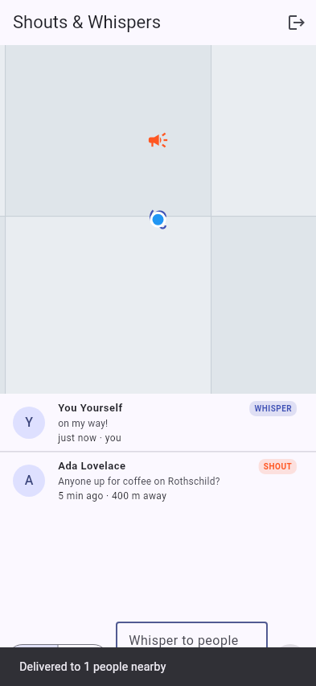 <!-- req-gallery:11.3:3 -->
- `11.4` **The audience is decided at send time.** Grace shouted two blocks
  away *before* you arrived there — your feed never shows it. You walk to
  that exact spot; the feed still doesn't. Only when Grace shouts *again*,
  now that you are nearby, does her message land. Late arrival never
  back-fills.

   <!-- req-gallery:11.4:1 -->
  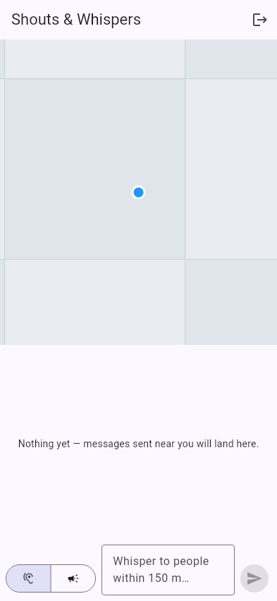 <!-- req-gallery:11.4:2 -->
  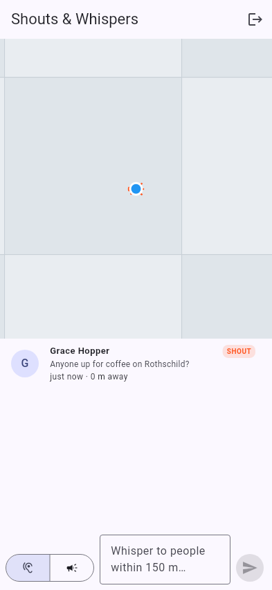 <!-- req-gallery:11.4:3 -->
- `11.5` **Permission trouble.** Mid-session the location permission is
  revoked — the banner explains, the send button locks (stale fix cleared).
  Retry after re-granting restores the fix and the button.

   <!-- req-gallery:11.5:1 -->
  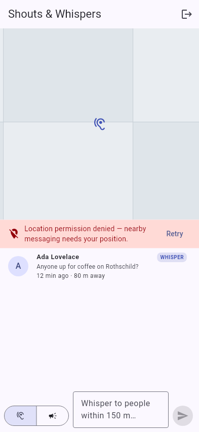 <!-- req-gallery:11.5:2 -->
   <!-- req-gallery:11.5:3 -->
- `11.6` **Pruning your feed.** A long-press on Ada's old message opens the
  confirmation; Delete removes it from the feed — the map marker goes with
  it.

  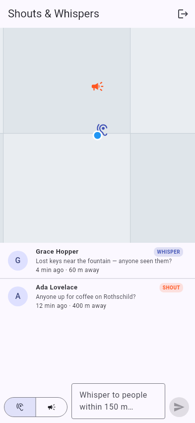 <!-- req-gallery:11.6:1 -->
  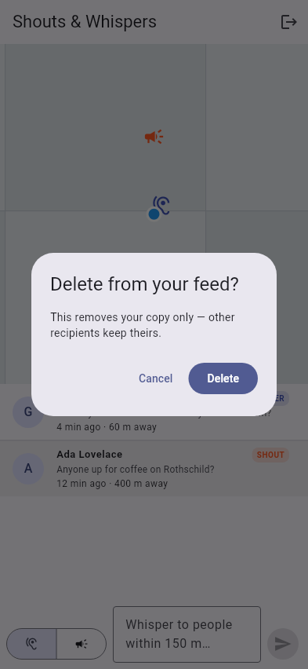 <!-- req-gallery:11.6:2 -->
  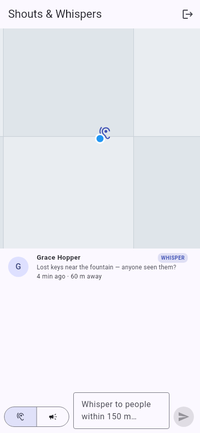 <!-- req-gallery:11.6:3 -->
- `11.7` **Signing out.** From a lived-in home screen, sign-out lands back
  on the sign-in screen.

  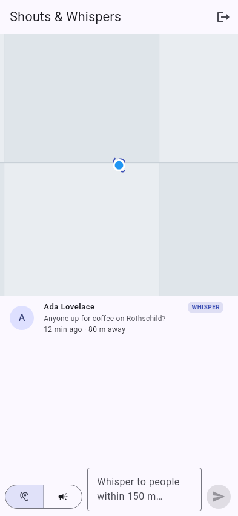 <!-- req-gallery:11.7:1 -->
   <!-- req-gallery:11.7:2 -->
